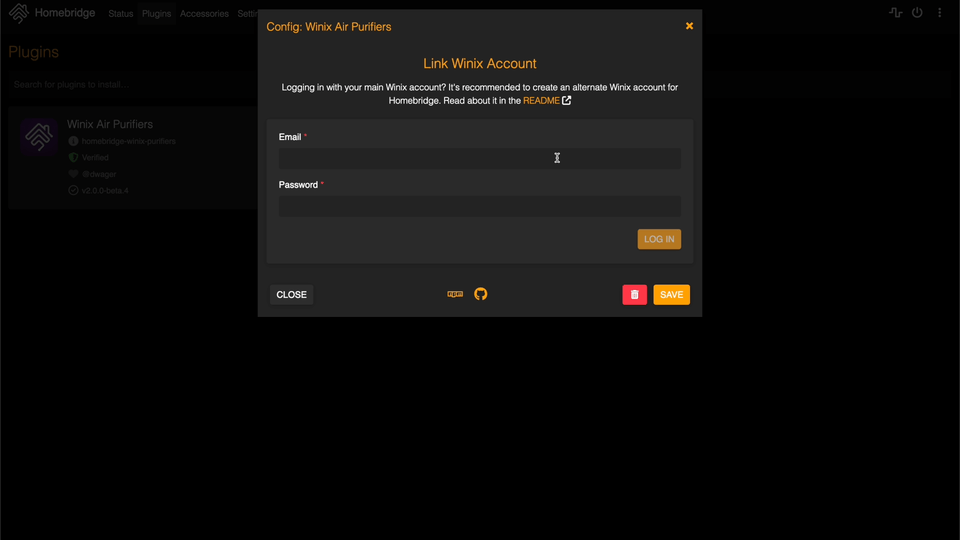

# homebridge-winix-purifiers

[](https://github.com/homebridge/homebridge/wiki/Verified-Plugins)
[](https://www.npmjs.com/package/homebridge-winix-purifiers)
[](https://www.npmjs.com/package/homebridge-winix-purifiers)

[Homebridge](https://homebridge.io) support for [Winix](https://www.winixamerica.com) air purifiers.

## Table of Contents

* [Features](#features)
* [Device Support](#device-support)
* [Configuration](#configuration)
    * [Alternate Winix Account Setup for Homebridge](#alternate-winix-account-setup-for-homebridge)
    * [Important: Set Your Encryption Key](#important-set-your-encryption-key)
    * [Homebridge Configuration UI](#homebridge-configuration-ui)
    * [Manual Configuration](#manual-configuration)
        * [Properties](#properties)
        * [Encrypting Your Password](#encrypting-your-password-for-manual-setup-and-hoobs-users)
* [FAQ](#faq)
    * [Upgrading from the old plugin architecture (v1.x.x) to the new one (v2.x.x)?](#upgrading-from-the-old-plugin-architecture-v1xx-to-the-new-one-v2xx)
    * [Using HOOBS?](#using-hoobs)
    * [Missing “Auto/Manual” switch in Home app?](#missing-automanual-switch-in-home-app)
    * [Having issues moving your purifier to a room in the Home app with the same name?](#having-issues-moving-your-purifier-to-a-room-in-the-home-app-with-the-same-name)
* [Acknowledgments](#acknowledgments)

## Features

- **Dynamic Device Discovery**: Automatically discovers and configures Winix purifiers linked to your account.
- **Control**: Power on/off, switch between sleep/auto/manual modes, and adjust airflow speed.
- **Customization**: Optionally expose Air Quality, Ambient Light, Plasmawave, Auto Mode, and Sleep Mode switches to
  HomeKit.
- **Filter Management**: Exposes the remaining filter life and provides an alert when it's time to change the filter,
  configurable to trigger at a specified percentage of remaining filter life.
- **Efficiency**: Features Winix API response caching to minimize requests and avoid rate limiting.
- **Reliability**: Automatically refreshes device list on a configurable interval to ensure devices are always
  up-to-date.
- **Seamless Authentication**: Automatically refreshes your Winix authentication token in the background, so you no
  longer need to manually re-authorize every 30 days.
- **Encrypted Storage**: Your Winix account password and refresh token are securely stored on disk using encryption,
  keeping your credentials safe.

## Device Support

This plugin officially supports the following Winix air purifiers:

* C545
* C909

While other models aren't explicitly blocked, they're not yet officially supported and may not work as expected.

## Configuration

### Alternate Winix Account Setup for Homebridge

Winix's system limits users to a single active session per account. When the same account is used simultaneously on the
Winix app and Homebridge, it can lead to being logged out from one of the sessions. An alternate account dedicated to
Homebridge prevents this issue, ensuring stable operation without frequent authentication disruptions.

_**Yes, this is an annoying and tedious one-time setup, but it is well worth not having to continually fix
authentication issues.**_

To create and link an alternate Winix account, please follow the instructions in the
[Alternate Winix Account: Creating and Linking](https://github.com/regaw-leinad/homebridge-winix-purifiers/wiki/Alternate-Winix-Account:-Creating-and-Linking)
Wiki page.

### Important: Set Your Encryption Key

For added security, you should set the `WINIX_ENCRYPTION_KEY` environment variable when running Homebridge. This will
allow you to use your own custom encryption key string to protect your stored password and refresh token. If this
variable is not set, the plugin will use a static default key, which is less secure. Directions for setting custom
environment variables can be found in the [Homebridge documentation](https://github.com/homebridge/homebridge/wiki).

### Homebridge Configuration UI

Easily configure the plugin through the [Homebridge Config UI X](https://www.npmjs.com/package/homebridge-config-ui-x).
Simply provide your Winix account credentials for automatic device discovery and provisioning.



### Manual Configuration

While not recommended, if manual setup is required, add the following to the `platforms` section of your `config.json`:

```json
{
  "platforms": [
    {
      "exposeAirQuality": true,
      "exposeAmbientLight": true,
      "exposePlasmawave": false,
      "exposeAutoSwitch": false,
      "exposeSleepSwitch": false,
      "filterReplacementIndicatorPercentage": 10,
      "cacheIntervalSeconds": 300,
      "deviceRefreshIntervalMinutes": 60,
      "auth": {
        "username": "your-email@domain.com",
        "password": "<encrypted-winix-password> (see below)",
        "userId": "f470ce5f-6b8e-44b4-a6db-b7f4d4c6f851"
      },
      "deviceOverrides": [
        {
          "deviceId": "123ABC456DEF_abc123xyz",
          "serialNumber": "WNXAI12345678",
          "nameDevice": "Living Room Air Purifier"
        },
        {
          "deviceId": "789XYZ987VWX_xyz789abc",
          "serialNumber": "WNXAI87654321",
          "nameDevice": "Bedroom Air Purifier",
          "nameAutoSwitch": "My Auto Switch"
        }
      ],
      "platform": "WinixPurifiers"
    }
  ]
}

```

#### Properties

| Name                                       | Default Value      | Note                                                                                                                     |
|--------------------------------------------|--------------------|--------------------------------------------------------------------------------------------------------------------------|
| `exposeAirQuality`                         | `false`            | Whether to expose the air quality sensors to HomeKit.                                                                    |
| `exposeAmbientLight`                       | `false`            | Whether to expose the ambient light sensors to HomeKit.                                                                  |
| `exposePlasmawave`                         | `false`            | Whether to expose switches for Plasmawave on/off.                                                                        |
| `exposeAutoSwitch`                         | `false`            | Whether to expose switches for Auto mode on/off.                                                                         |
| `exposeSleepSwitch`                        | `false`            | Whether to expose switches for Sleep mode on/off.                                                                        |
| `filterReplacementIndicatorPercentage`     | `10`               | Percentage of filter life remaining to trigger a filter replacement alert.                                               |
| `cacheIntervalSeconds`                     | `60`               | Time, in seconds, for how long to reuse cached responses from Winix.                                                     |
| `deviceRefreshIntervalMinutes`             | `60`               | Time, in minutes, for how often to poll Winix to refresh the device list.                                                |
| `auth.username`                            | `""`               | Your Winix account username (email). This field is meant to be read-only in the UI.                                      |
| `auth.password`                            | `""`               | Your Winix account password (encrypted). This field is meant to be read-only in the UI. See below for manual generation. |
| `auth.userId`                              | `""`               | Your Winix user ID for the Cognito User Pool. This field is meant to be read-only after being generated in the UI.       |
| `deviceOverrides[].deviceId`               | `"<deviceId>"`     | The ID of the device.                                                                                                    |
| `deviceOverrides[].serialNumber`           | `"WNXAI00000000"`  | The serial number of the device. Optional.                                                                               |
| `deviceOverrides[].nameDevice`             | `"<Winix Alias>"`  | The display name of the device. Optional.                                                                                |
| `deviceOverrides[].nameAirQualitySensor`   | `"Air Quality"`    | The display name of the air quality sensor. Optional.                                                                    |
| `deviceOverrides[].nameAmbientLightSensor` | `"Ambient Light"`  | The display name of the ambient light sensor. Optional.                                                                  |
| `deviceOverrides[].namePlasmawaveSwitch`   | `"Plasmawave"`     | The display name of the Plasmawave switch. Optional.                                                                     |
| `deviceOverrides[].nameAutoSwitch`         | `"Auto Mode"`      | The display name of the Auto switch. Optional.                                                                           |
| `deviceOverrides[].nameSleepSwitch`        | `"Sleep"`          | The display name of the Sleep switch. Optional.                                                                          |
| `platform`                                 | `"WinixPurifiers"` | Must always be `"WinixPurifiers"` in order for the plugin to load this config.                                           |

### Encrypting Your Password (For Manual Setup and HOOBS Users)

If you're configuring the plugin manually or using HOOBS, you need to store your Winix password securely in the
configuration file. To do this, you must first encrypt your password using the provided `encrypt-password` script.

#### Steps to encrypt your password:

1. **Clone the repository**:

You’ll need to clone this plugin's repository locally to run the encryption script. Make sure you have **Node.js 20+**
installed on your machine.

```bash
git clone https://github.com/regaw-leinad/homebridge-winix-purifiers.git
cd homebridge-winix-purifiers
```

2. **Run the encryption command**:

Use the following command in your terminal:

```bash
npm run encrypt-password <winix-password> <your-encryption-key>
```

Replace `<winix-password>` with your actual Winix account password and `<your-encryption-key>` with the key you plan to
use.

3. **Update your configuration**:

The script will output your encrypted password. Copy the result and paste it into the `password` field in your
`config.json` under the `auth` section:

```json
{
  "auth": {
    "username": "your-email@domain.com",
    "userId": "f470ce5f-6b8e-44b4-a6db-b7f4d4c6f851",
    "password": "<encrypted-password>"
  }
}
```

This ensures that your password is securely stored within the configuration file.

## FAQ

### Upgrading from the old plugin architecture (v1.x.x) to the new one (v2.x.x)?

Unfortunately, there's no way to directly migrate from the old plugin architecture to the new one.
Please follow the Migration Guide in the Wiki:

[Migrating from v1.x.x to v2.x.x](https://github.com/regaw-leinad/homebridge-winix-purifiers/wiki/Migrating-from-v1.x.x-to-v2.x.x).

### Using HOOBS?

If you're using [HOOBS](https://hoobs.org), you can install the plugin directly from the HOOBS interface. You will not
be able to use the custom configuration UI, since it is not supported in HOOBS. You will need to use the manual
configuration method. Please see
[this issue](https://github.com/regaw-leinad/homebridge-winix-purifiers/issues/16#issuecomment-2241786391) for more
details on obtaining the required `auth` values. See
[Encrypting Your Password](#encrypting-your-password-for-manual-setup-and-hoobs-users) for instructions on encrypting
your Winix password.

### Auth Error?

Getting `error generating winix account from existing auth: NotAuthorizedException: Refresh Token has expired`? Winix
refresh tokens expire after 30 days. For now, you will need to generate a new refresh token by re-authenticating with
Winix. Find the `Reauthenticate with Winix` button in the plugin config settings in the Homebridge UI, and sign in with
your email and password. Work has started on a new feature to automate this process
([branch](https://github.com/regaw-leinad/homebridge-winix-purifiers/tree/password-auth)).

### Missing “Auto/Manual” switch in Home app?

Please see [this issue](https://github.com/regaw-leinad/homebridge-winix-purifiers/issues/1) for more details.

### Having issues moving your purifier to a room in the Home app with the same name?

Try moving the purifier to a room with a different name, then move it back to the desired room. For example, if you have
a room named “Bedroom” and a purifier named “Bedroom”, try moving the purifier to a room named "Living Room", then move
it to "Bedroom".

## Acknowledgments

- [@banzalik](https://github.com/banzalik) - wrote the
  first [Winix C545 Homebridge plugin](https://github.com/banzalik/homebridge-winix-c545)
- [@hfern](https://github.com/hfern) - wrote the
  [Python Driver and CLI for the Winix C545 Air Purifier](https://github.com/hfern/winix) in Python, which this plugin's
  [authentication system](https://github.com/regaw-leinad/winix-api) is heavily based on
- [@jonnyborbs](https://github.com/jonnyborbs) - invaluable testing and feedback
- [@martinianodl](https://github.com/martinianodl) - discovered the alternate Winix account setup for Homebridge
- [@shyawnkarim](https://github.com/shyawnkarim) - all around good guy and initial plugin tester
